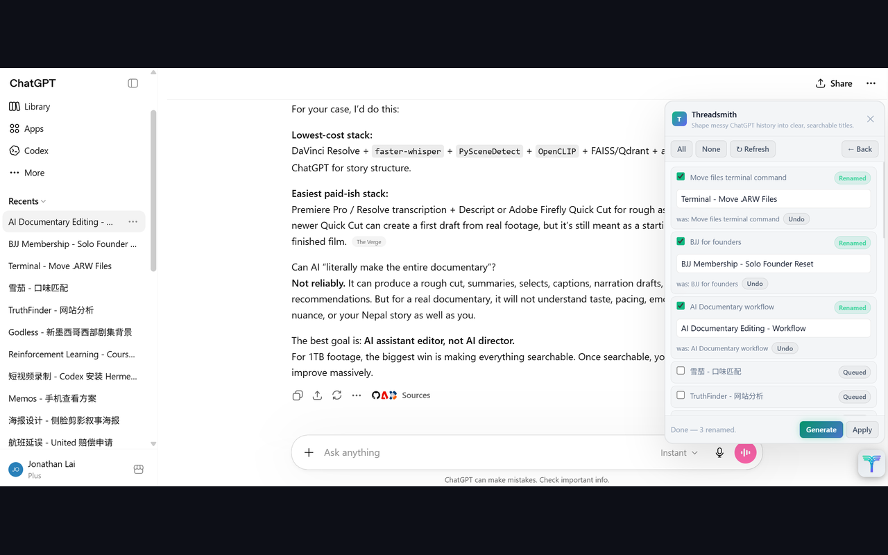
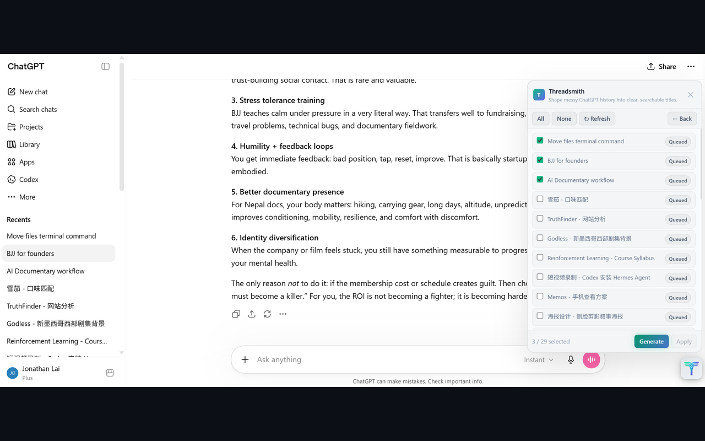

<div align="center">
  
  <h1>Threadsmith</h1>
  <p><em>Shape messy ChatGPT history into clear, searchable titles.</em></p>
</div>

Threadsmith is a Chrome extension that renames your ChatGPT conversations into
clear, structured, searchable titles — in Chinese or English — using your own
AI provider. You review every suggestion before anything changes, and any
applied rename can be undone.

- 🌐 **Landing page:** https://jonlai211.github.io/Threadsmith/
- 🔒 **Privacy:** [`PRIVACY.md`](PRIVACY.md)
- 🧩 **Chrome Web Store:** _coming soon_

## Screenshots

Apply clear titles with one-click undo — and a tidied sidebar:



Review and preview suggestions before anything changes:



## Features

- **Review before you rename.** Generate title previews, edit them, uncheck any
  you don't want, then apply — nothing is written without your confirmation.
- **Undo.** Each applied rename can be restored to its original title from the list.
- **Bring your own provider.** Works with any OpenAI-compatible API — DeepSeek,
  OpenAI, OpenRouter, or a custom endpoint — using your own key.
- **Bilingual titles.** Simplified Chinese or English, or Auto to match each
  conversation. Proper nouns, brands, and technical names are kept as-is.
- **Refresh on demand.** Scroll the sidebar to load more history (or start a new
  chat), then click Refresh to pull new conversations into the list — in sidebar
  order, without losing your selections or generated previews.
- **Private by design.** No backend; conversation text goes only to the provider
  you configure. Settings stay in `chrome.storage.local`.

## How it works

1. Open `https://chatgpt.com`.
2. Click the floating Threadsmith launcher (or the toolbar popup).
3. Click **Generate Titles** to open the review list.
4. Scroll the sidebar to load more history (or start a new chat), then click **Refresh** to update the list.
5. Select sessions (**All** / **None**), then **Generate** previews.
6. Edit or uncheck anything you don't like, then **Apply**.
7. Use the per-row **Undo** to restore an original title if needed.

## Providers & settings

| Setting | Notes |
|---|---|
| **Provider** | DeepSeek, OpenAI, OpenRouter, or Custom (OpenAI-compatible) |
| **API key** | Your own key; stored locally |
| **Model** | Defaults to the provider's default (e.g. `deepseek-v4-flash`) |
| **Base URL** | Custom provider only |
| **Title language** | Auto · 中文 · English |

Settings are stored in `chrome.storage.local` under `threadsmith.settings`
(the legacy `cso.settings` key is migrated automatically). A custom endpoint
requests host access from the toolbar popup (`optional_host_permissions`).

The LLM request runs in the background service worker so it uses the extension's
host permissions and is not blocked by the ChatGPT page's CORS policy.

## Install from source

```bash
git clone https://github.com/jonlai211/Threadsmith.git
```

1. Open `chrome://extensions`.
2. Enable **Developer mode**.
3. Click **Load unpacked** and select the cloned `Threadsmith` folder.
4. Open `https://chatgpt.com` and set your provider key in the popup or card.
5. Reload the extension after any code changes.

## Project structure

```
manifest.json        MV3 manifest: permissions, popup, worker, content scripts
content_script.js    In-page UI + extraction + orchestration + native rename
service_worker.js    Transport layer (OpenAI-compatible /chat/completions)
lib/providers.js     Provider presets, settings schema + migration, transport
lib/prompts.js       Per-language title prompt templates
lib/validators.js    Shared + per-language title validation
popup.html/.css/.js  Toolbar popup for settings and starting a review
icons/               Extension icons (gen_icons.py regenerates them)
docs/                Landing page (GitHub Pages, served from /docs)
PRIVACY.md           Privacy policy
```

## Privacy

Threadsmith has no backend. Conversation text is sent only to the AI provider
you configure, using your own API key, solely to generate a title. Settings are
stored locally and nothing is collected by the developer. See
[`PRIVACY.md`](PRIVACY.md) for the full policy.

## License

[MIT](LICENSE) © Jonathan Lai
